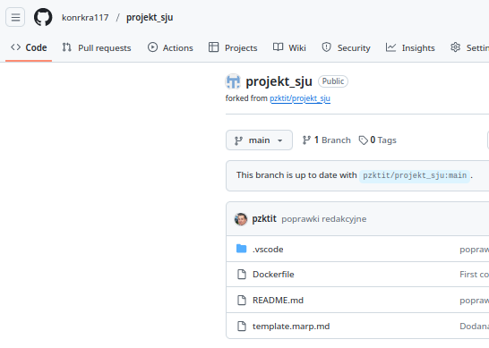
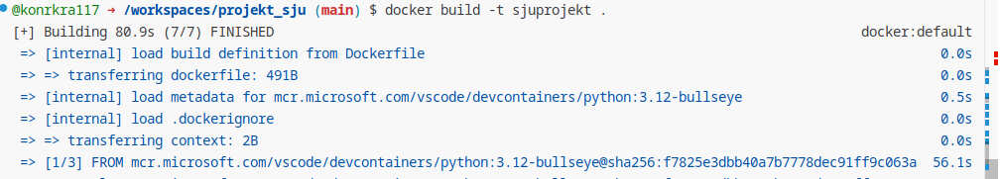
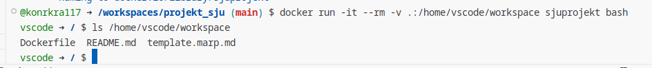
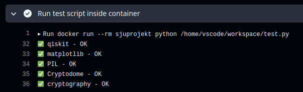
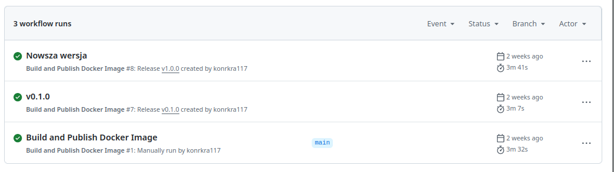
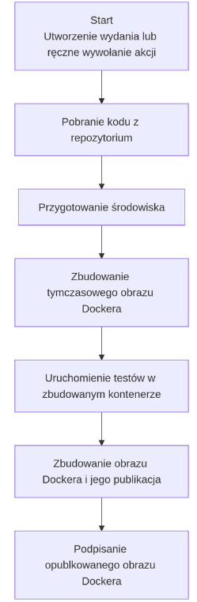
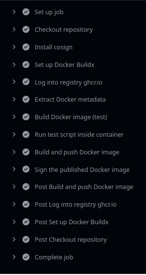

<div class="flex flex-col items-center justify-center h-full text-center">


## Sieć jako Usługa
### Raport z realizacji projektu

###### Imię i nazwisko: *Konrad Krawiec*
###### Kierunek: *Teleinformatyka S2*
###### Semestr: *1*

</div>

---

# Przygotowanie repozytorium

W pierwszym etapie wykonano *Fork* repozytorium.


---

# Przygotowanie repozytorium

W drugim etapie otwarto repozytorium za pomocą *Visual Studio Code*, uruchomionego w środowisku *Github Codespaces*.

1. Dokonano sprawdzenia poprawności budowania obrazu Dockera


---

# Przygotowanie repozytorium

W drugim etapie otwarto repozytorium za pomocą *Visual Studio Code*, uruchomionego w środowisku *Github Codespaces*.

2. Następnie sprawdzono, czy wewnątrz kontenera widoczne są pliki projektu


---

# Modyfikacja Dockerfile

Do pliku **Dockerfile** dodano następujące polecenie, aby instalowane były wymagane pakiety: Qiskit, Matplotlib, Pillow, Pycryptodomex, Cryptography.

```RUN pip3 install --disable-pip-version-check --no-cache-dir Qiskit Matplotlib Pillow Pycryptodomex Cryptography```

---

# Kontener developerski

W celu utworzenia kontenera deweloperskiego zawierającego rozszerzenia: *Markdown All in One*, *Marp for VS Code*, *GitHub Actions*, do repozytorium dodano plik `.devcontainer/devcontainer.json` o następującej treści:

```
{
    "workspaceMount": "source=${localWorkspaceFolder},target=/home/vscode/workspace,type=bind,consistency=cached",
    "workspaceFolder": "/home/vscode/workspace",
    "name": "Projekt-SJU",
    "image": "sjuprojekt",
    "customizations": {
      "vscode": {
        "extensions": ["ms-python.python", "ms-toolsai.jupyter", "yzhang.markdown-all-in-one", "marp-team.marp-vscode", "GitHub.vscode-github-actions"]
      }
    },
    "postCreateCommand": "pip install --no-cache-dir -r requirements.txt && uname -a && python --version && pip --version",
    "remoteUser": "vscode"
}
```

---

# GitHub Action

1. W celu konfiguracji Github Actions, został utworzony plik `.github/workflows/docker-publish.yml`, zawierający konfigurację akcji.
2. Akcja ma za zadanie automatycznie zbudować obraz Dockera i go przetestować.


--- 

# GitHub Action

3. Akcja wywoływana jest automatycznie po utworzeniu *Release*. Można ją także wywołać ręcznie.


---

4. Po utworzeniu znacznika wersji i poprawnym wykonaniu się akcji, dokonano zmiany wersji obrazu w pliku `.devcontainer/devcontainer.json` na taką, która została zbudowana przez akcję GitHub.

Przed:
```
    "image": "sjuprojekt",
```
Po:
```
    "image": "ghcr.io/konrkra117/projekt_sju:v1.0.0",
```

---

# Diagram przepływu pracy

Rysunki obok przedstawiają diagram przepływu pracy oraz poszczególne etapy wywołanego Github Action.





---

# Praca z repozytorium w kontenerze developerskim

Repozytorium poprawnie otwiera się w kontenerze deweloperskim, jednak do poprawnego działania notatników Jupytera z przedmiotu KST, konieczne było dodanie w pliku `Dockerfile` polecenia instalującego bibliotekę `pylatexenc`, a następnie utworzenie kolejnej wersji *Release* i ponowna aktualizacja w polu `image` w pliku `.devcontainer/devcontainer.json`. Po wykonaniu tych czynności notatniki wykonywały się poprawnie.

---

# Podsumowanie

### Co było najtrudniejsze?

Największą trudność w realizacji sprawiła konfiguracja GitHub Actions. Nieco problemów sprawiała także sprawna obsługa *Visual Studio Code* za pośrednictwem *Github Codespaces*.

### Czego się nauczyłem?
- obsługi Dockera, pracy z kontenerami deweloperskimi
- korzystania z Github Actions
